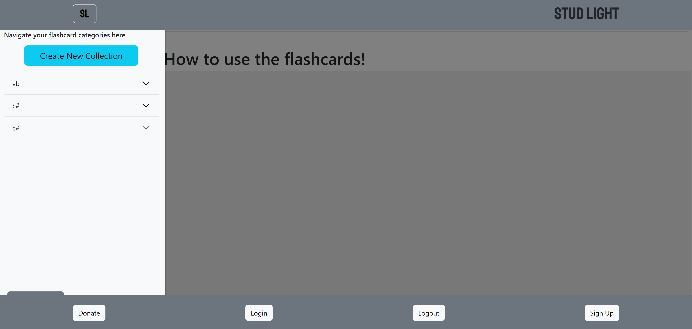
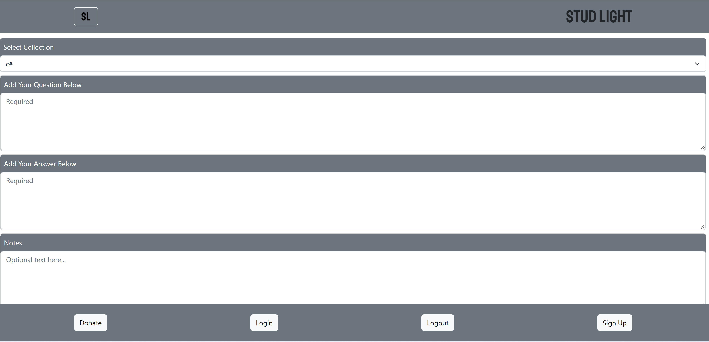
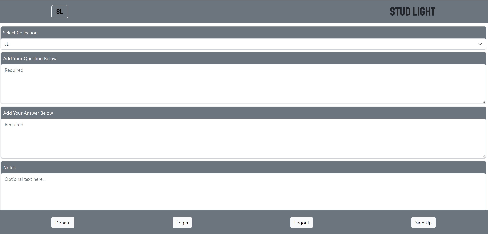

# Title of the Project:

# Stud-Light

## Description:

## _This is a falsh card website, it enables users of creating an account then creating their own flash cards. Users are able to add questions, answers, and notes to their cards. The team members of stud-light website used the most cutting edge technologies like: MongoDb, Qraph QL, and Apollo for the backend. React and bootstrap fr the front end, and Stripe for donation payments.

## Table of Content:

1. [Installation Instructions](#installation)
2. [Usage Information](#usage)
3. [License Information](#License)
4. [Contribution](#contributing)
5. [Tests](#tests)
6. [Questions](#questions)

## installation:

## 1. Run command "npm i in root folder to install dependancies"

## 2. Run command "npm run seed" to seed the database

## 3. Run command "npm run develop" to start the engine

## Usage:

## Educational purposes 

## License:

## N/A

## contributing:

## Matthew Yang, Charles Hargrave, Tyler Linch, Chase Metherd, David Healy, Wasim Mohammad

## Tests:

## N/A

## Questions:

you can finde our GitHub repository at:

## [dhealy83](https://github.com/dhealy83)

If you have any questions please email us at:

## Wasim Mohammad: wsmohd87@gmail.com
## Chase Metherd: Rylan19@gmail.com
## Charles Hargrave: charles.hargrave.jr@gmail.com
## Tyler Linch: tjlinch@gmail.com
## Matthew Yang: matthew.yang@hunterdoulas.com
## David Healy: drtjprdave@gmail.com

## [Heroku link](https://stud-lite.herokuapp.com/)
